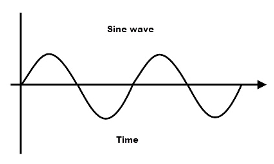
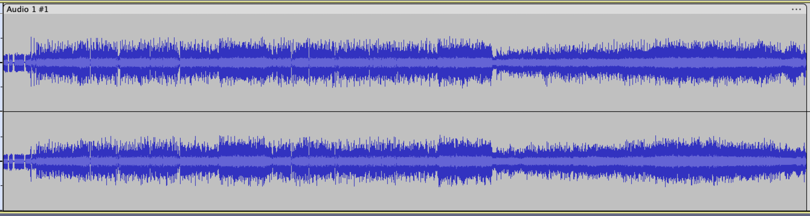

# An Introduction to Digital Audio

What is audio? Moreover, what is sound? These are important questions to ask and answer if you study music.

**Music** is often defined as ordered **sound**, sound being perceivable changes in air pressure. When these changes occur with [periodicity](https://en.wikipedia.org/wiki/Periodic_function) at rates between 20 and 20,000 cycles per second (Hertz/Hz), they are perceived as **pitch**. When they occur slower, they are perceived as **rhythm**, and are imperceivable when faster than ~20kHz.  

**Audio** is an abstraction of sound. Where sound describes changes in air pressure over time, audio describes the change of an arbitrary value (known as **amplitude**) over time, particularly changes in the **audio band** of 20Hz-20kHz. Audio allows for high-resolution representation of music in mediums other than sound, which allows for the **recording and playback** of music. 

<figure>

<figcaption>
Wax cylinders, an early recording medium 
</figcaption>
</figure>

[Electrification](https://en.wikipedia.org/wiki/Electrification) in the 20th century allowed for the representation of audio signals as changes of voltage in electric current, drastically changing many aspects of music. This included the invention of electric and electronic instruments, sound amplification, and effect processing. 

Since the dawn of the 21st century, [digital computers](https://en.wikipedia.org/wiki/Computer) have become the standard tool for composition, recording, processing, and playback- nearly all music is touched by computers in some way. 

Despite this, curriculum in digital audio is underdeveloped in many university and high school music programs. 

The goal of this document is to confer a basic understanding of the underlying theory behind digital audio, as well as an understanding of the tools the medium makes available. 

## Digital Audio Basics

### Sampling
The underlying theory of digital audio was developed in tandem with the digital computer itself. The fundamental hurdle was how to represent [continuous](https://en.wikipedia.org/wiki/Continuous_function) data as [discrete](https://en.wikipedia.org/wiki/Discrete_mathematics) data, the only kind a digital computer can operate on. 

The answer was found in [sampling](https://en.wikipedia.org/wiki/Sampling_(signal_processing)). You may know that the illusion of continuous motion in a film is created by the rapid playback of still images known as *frames*. Audio sampling operates on the same principal. A major difference is that, while frame rates for video are set between 24-60 per second, audio *sample rates* are typically set above **40,000** samples per second. 

<figure>

<figcaption>
A visual depiction of sampling
</figcaption>
</figure>

The reason for this high framerate is explained by the [Nyquist-Shannon sampling theorem](https://en.wikipedia.org/wiki/Nyquist%E2%80%93Shannon_sampling_theorem), which posits that, to accurately sample a signal, the sampling rate must be at least twice the signal's highest frequency component. Because humans can hear up to ~20,000 Hertz, only sample rates greater than ~40,000 are considered sufficient. 

### Time vs. Frequency Domain Representation 
Digital audio can be conceptualized and operated on in two distinct ways.

One is the **time domain**, which deals with samples as a sequence of discrete amplitude values. Time domain audio data maps well to a two-dimensional graphic representation: for each sample or *timestep* (typically x-axis), there is a corresponding amplitude (y-axis). 

<figure>

<figcaption>
A time domain representation of a sine wave, the most elemental waveform
</figcaption>
</figure>

<figure>

<figcaption>
A time domain representation of the song <i>Limelight</i> by Rush
</figcaption>
</figure>

Time domain representations don't always track well to human perception of audio however, because we do not perceive amplitude or **phase**, but instead its derivate, **frequency**.

Thankfully, frequency data can be extracted from time domain data using the **fourier transform**, one of the most important algorithms in signal processing.

In the 18th century, mathematician [Joseph Fourier](https://en.wikipedia.org/wiki/Joseph_Fourier) proposed that any signal can be represented as a series of sinusoidal frequencies summed in different proportions. By computing the fourier transform and graphing time on the x-axis, frequency on the y-axis, and the amplitude of each frequency component as color, a **frequency domain** representation can be created. 

<figure>

<figcaption>
A frequency domain representation of <i>Limelight</i>. Notice how there is more <i>spectral energy</i> in the lower frequencies. 
</figcaption>
</figure>

### Basic operations 
When transforming digital audio data, the two most common (and most basic) operations are **addition** and **multiplication**. 

Adding two signals is equivalent to [mixing](https://en.wikipedia.org/wiki/Audio_mixing_(recorded_music)) in the analog domain. To create a waveform that represents a song, the individual instrument tracks are added together. 

Because the amplitude of audio signals should be limited to the range (-1, 1), tracks often have their individual amplitudes scaled before summation. This is done with multiplication.  

Multiplying every sample of an audio signal by a positive number less than 1 results in [attenuation](https://en.wikipedia.org/wiki/Attenuation), essentially the reduction of a signal's volume.

<!--TODO: Add Attenuation Image-->

Multiplying a signal's amplitude values by a number greater than 1 represents [amplification](https://en.wikipedia.org/wiki/Amplifier), an increase in volume.

<!--TODO: Add Amplification Image-->

As shown in the <a href="#effects">Effects</a> section, more complicated transformations are made by chaining together many simple addition and multiplication operations.

### Synthesis 

<!--TODO: Add Images-->

Much early work in digital audio revolved not around the processing of recorded musical signals, but instead the synthesis of sounds from scratch. **Digital synthesis** remains an active field of research, as the possibilities it affords are nearly limitless.

Working from the principles of fourier analysis, [additive synthesis](https://en.wikipedia.org/wiki/Additive_synthesis) creates timbres through the addition of sine waves. It was one of the earliest used techniques. Because additive synthesis requires an oscillator for every frequency component, it is considered a computationally expensive technique that poses problems in the context of limited computing resources. 

[Frequency modulation synthesis](https://en.wikipedia.org/wiki/Frequency_modulation_synthesis) was developed as a computationally-inexpensive alternative to additive synthesis. It allows for the creation of many frequencies from as little as two oscillators, but is less intuitive to parameterize than additive synthesis.

<!--TODO: introduce sampling synthesis?-->

Less prevalent but equally interesting techniques include [physical modeling](https://en.wikipedia.org/wiki/Physical_modelling_synthesis), [subtractive](https://en.wikipedia.org/wiki/Subtractive_synthesis), and [granular](https://en.wikipedia.org/wiki/Granular_synthesis) synthesis.

### Signal processing
As mentioned prior, digital audio allows for the manipulation of existing musical signals. Operations range from basic attenuation to radical alterations like [pitch correction](https://en.wikipedia.org/wiki/Auto-Tune). 

When [digital signal processing](https://en.wikipedia.org/wiki/Digital_signal_processing) calculations can occur faster than human perception of discrete events in time, perceptually [real-time](https://en.wikipedia.org/wiki/Real-time_computing) processing is possible. 

Modern computers are often capable of performing billions of operations per seconds, making real-time digital audio processing increasingly popular among practicing musicians.

## A Survey of Digital Audio Tools
<!--Intro Paragraph-->

### Effects
[**Equalization**](https://en.wikipedia.org/wiki/Equalization_(audio)) 

refers to the attenuation of certain frequencies in an audio signal, and is one of the most ubiquitous audio effects. Modern EQ is performed with [digital filters](https://en.wikipedia.org/wiki/Digital_filter) that track amplitude over time and respond according to user-friendly parameters. 

Initially, filters were used to compensate for the infidelity of early recording techniques, but have since become powerful tools for both sweetening natural timbres and sculpting wholly new electronic sounds. 

[**Dynamic range compression**](https://en.wikipedia.org/wiki/Dynamic_range_compression) 

is one of the most widely used effects in audio. By lowering the volume of loud sections on a track, the entire track's volume can be raised without fear of [clipping](https://en.wikipedia.org/wiki/Clipping_(audio)). This allows for increased perceptual loudness, and creates consistency in a clip's volume.

While compression is an essential tool in popular music, its overuse has created controversy in the music industry, culminating in the [loudness war](https://en.wikipedia.org/wiki/Loudness_war#2000s) of the early 2000s. 

<figure>

<figcaption>
Two mixes of <i>My Apocalypse</i> by Metallica, one heavily compressed (top)
</figcaption>
</figure>

It is generally recommended to use compression subtly to sweeten sounds, rather than as an effect to transform their character. 

**Time effects**, 

like digital filters, leverage memory of a signal's past values to create output samples. Digital audio is optimal for this, because it is capable of nearly perfect recording, storage and playback of audio samples. The first commercial digital audio devices were in fact time effects, made by [Eventide Inc.](https://en.wikipedia.org/wiki/Eventide,_Inc) in the 1970s.  

[Reverb](https://en.wikipedia.org/wiki/Reverb_effect) is a ubiquitous time effect that mimics the physical phenomenon of acoustic reflection, where audio in a room is not only heard coming from its source but also reflected from many surfaces.

Another popular time effect is [delay](https://en.wikipedia.org/wiki/Delay_(audio_effect)), which repeats signal history preceding the present by an amount of time perceived as a discrete repeat.

**Modulation effects**

involve the manipulation of an audio signal by a periodic function, typically an elemental waveform produced by a **low-frequency oscillator** ([LFO](https://en.wikipedia.org/wiki/Electronic_oscillator)). When one signal modulates another, the signal being modified is called the **carrier** and the signal that modifies it is called the **modulator**. 

The simplest modulation effect is [tremolo](), which modulates a signal's volume. More complex modulation effects include chorus, detune and phaser.

**Spectral Processing** 

involves the manipulation of audio data in the frequency domain. Common examples are [convolution](https://en.wikipedia.org/wiki/Convolution) and [pitch-correction](https://en.wikipedia.org/wiki/Pitch_correction), effects that are difficult to execute cleanly in the time domain. 

### Composition and Production

In the 21st century, [streaming](https://en.wikipedia.org/wiki/Music_streaming_service) has become the dominant way recorded music is consumed, accounting for the majority of revenue in the US music industry since 2016.

Streaming necessitates the **distribution** and **playback** of music in digital formats, which is conducive to its **production** in the digital domain as well.

Digital music production is typically accomplished in the context of a **Digital Audio Workstation** ([DAW](https://en.wikipedia.org/wiki/Digital_audio_workstation)), a tool that seeks to encapsulate the functions of [recording studio](https://en.wikipedia.org/wiki/Recording_studio) in highly portable software.

<figure>

<figcaption>
The graphical user interface of <i>Pro Tools</i>, a popular DAW
</figcaption>
</figure>

DAWs allow for almost any digital signal processing imaginable, because they generally support [plugins](https://en.wikipedia.org/wiki/Audio_plug-in), external software meant to run inside large applications.

Another tool is [music notation software](https://en.wikipedia.org/wiki/Scorewriter), which digitizes composition in [modern staff notation](https://en.wikipedia.org/wiki/Musical_notation#Modern_staff_notation). These programs allow for real-time playback of music as it is being written, and accepts input in the form of keyboard/mouse data or MIDI data.

<figure>

<figcaption>
<i>MuseScore</i>, a <a href="https://en.wikipedia.org/wiki/Free_and_open-source_software">free & open-source</a> music notation application 
</figcaption>
</figure>

- Audio Repair Tools 
- MIDI!!!

### Analysis Tools
- Music visualization (meters, spectrogram, ...?)

[Music information retrieval](https://en.wikipedia.org/wiki/Music_information_retrieval) is a subfield of [computer audition](https://en.wikipedia.org/wiki/Computer_audition) that studies how audio data maps to music cognition. It informs the generation of music using [artificial intelligence](https://en.wikipedia.org/wiki/Music_and_artificial_intelligence), and allows for categorization of digital audio by markers such as tempo, key, mood, and even genre. By mapping the conventions of a music system such as [tonal harmony](https://en.wikipedia.org/wiki/Tonality) to audio data, music conforming to that system can be generated by [algorithmically](https://en.wikipedia.org/wiki/Algorithm).

## Conclusion 